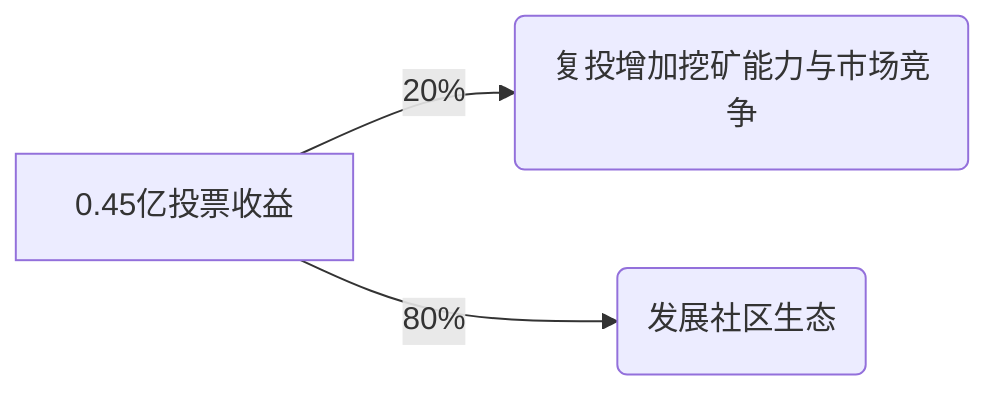
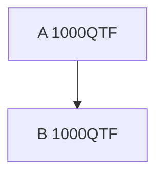
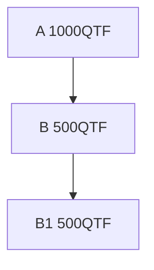

## 量子基金项目
- Quantum Fund Token 简称QFT

#### 项目背景
- 近年来，随着加密货币市场的快速发展，全球投资者对这一新兴资产类别的关注度日益增加。然而，与此同时，市场上也涌现了大量的不良项目和庞氏骗局，导致许多投资者蒙受了巨大的经济损失。这些骗局往往打着高回报的旗号，利用信息不对称和投资者的贪婪心理，建立起资金盘式的运营模式，最终在市场波动中瓦解，给投资者带来了巨大的风险。

- 在这一背景下，市场对安全可靠的投资方式的需求变得尤为迫切。传统的投资方式难以适应加密货币市场的高波动性和复杂性，而依靠单纯的人为判断进行投资决策，容易受到情绪和短期市场波动的影响。

- 量子基金项目(QFT)的发起正是在这样的市场环境中应运而生。我们致力于通过结合前沿的量化分析技术和严谨的风控措施，为专业投资者提供一个高效、安全、透明的投资平台。我们的目标是摒弃市场中的投机和不良行为，专注于通过科学的投资方法和数据驱动的决策过程，实现稳定的投资回报，帮助投资者在动荡的市场环境中实现财富的长期增长。

- 这一项目不仅是对现有市场乱象的一种回应，也是我们对加密货币投资未来的展望和承诺。通过引入量化方法，我们希望为投资者带来更为理性和透明的投资选择，并推动整个行业向更加健康和可持续的方向发展。

#### 运行机制
- 为了促进量子基金的推广，我们引入了一种创新的挖矿机制，该机制借鉴了POS（权益证明）挖矿的理念，投票越多，算力越强。这个机制的设计杜绝了泡沫风险，不会导致系统崩盘。

- 为了吸引更多人参与，我们设计了一种独特的推广机制。当被推广的人挖矿算力增加时，推广者也会收益，反之亦然，从而激励大家积极投票和推广。这种机制不仅保证了参与者的动力，还通过非线性算法有效防止了推广作弊行为。作弊将导致算力的损失，从而减少投资者的收益。通过这一设计，我们确保了整个系统的公平性和透明性，促进了生态的健康与可持续发展。[算力计算规则](#算力计算规则)

- 我们将合约代码完全开源，接受同行专家的严格审查，确保系统的透明性和安全性。开源不仅展现了我们的技术实力和信心，也为项目注入了走向世界的基因。我们相信，通过全球化的合作与交流，量子基金能够在国际舞台上占据一席之地，并为更多投资者带来可信赖的投资选择。[合约开源地址](https://github.com/QuantumFunds/smart-contracts)

##### 发行机制
- 量子基金计划发行总量为10亿的代币，其中0.5亿将作为初始金额发行，其余的9.5亿将通过挖矿的方式逐步释放。这个设计确保了代币的分配能够有效激励参与者，并在项目早期提供充足的流动性，支持生态系统的稳步发展。
- 初始0.5亿金额分配:

项目   | 数量
:----:|:-----:
去中心化交易所 | 0.05亿
投票金额 | 0.45亿

- 每秒产出1个QFT，9.5亿可挖10995.37天(约30.12年)
- 0.45亿投票的挖矿产出，80%的产出用于社区推广，20%产生用于复投，详细的流程图为:

- 社区生态规则
    - 10%的投资金额进入基金，用于量化投资。
    - 根据市场行情制定合适的推广规则。

##### 挖矿规则
- 每秒挖出一个QFT。
- 每周对挖矿结算一次。系统会记录下来一周内提交的最大算力作为有效算力，本周挖矿的金额为:(挖矿金额(7*24*3600) + 基金收益) * 该地址的有效算力 / 总和有效算力。
- 13周为一个挖矿收益周期。在当前收益周期(13周)内，因基金收益而购买的QFT转入到挖矿合约，会成为下一个收益周期的基金收益供大家挖矿，来提高挖矿的收益。
- 撤投后，需要等待两个结算周期(2周)。
- 每周要挖矿一次增加用户粘性，如果没有操作，就错过了一次收益。

##### 算力规则
- 推广好友，提升算力，增加挖矿收益
- A推广B的两种情况
> 正常推广

> 下级拆分

- 推广就是一棵不停向下蔓延的树,如果使用最简单的方法来做推广,不能保证推广者的收益.     
> - 示例1:
> 1. A推广了B，而B地址有1000个QFT.
> 2. A的推广值为1000,B的推广为0. 
> 3. B创建一个新账户B1，让B和B1建立推广关系，并把金额转到B1上.
> 4. A的推广值为0，B推广值1000，B1的推广值0，而A作为一个推广者，却没有任何收益.

- 如果把推广关系调整为上下级之间金额的最小值，且一个地址与上级也有关系，防止B把金额全部转走。  
> - 示例2：
> 1. 假设A推广了B，他们手中都有1000个QTF.  
> 2. A增加的推广值为1000，B的推广值也为1000.  
> 3. B创建一个新账户B1，并把1000个QFT转给B1，这样两个地址的收益都是0，B显然不会这样做，如果把500的QFT转给B1，
> 4. A增加的推广值为500  
    B的推广值为500+500=1000  
    B1的推广值为500  
    B账户的全部推广值为1000+500=1500，创建B1账户后，让上级的推广减少了500，而自己增加了500，这个规则虽然比示例1好很多，但是依然对推广者有利益损失。

- _针对上面的推广难题,提出了非线性算法，每个账户的基本算力等于投票金额的**1.125次方**，自己的推广算力与下级的权重为**1**, 与上级的权重为**1**，自身的权重为**6**。_   
> - **计算方法**  
> **基本算力:** $\Large pow(x) = x^{1.125} = x^{9/8} = x * \sqrt[8]{x}$      
> **实际算力:** $\Large f(x) = 6 * pow(x) + \min(pow(x),pow(x_{up})) + \sum(\min(pow(x),pow(x_{down})))$  
> - 示例3： 
> 1. A推广了B，A和B地址中分别有1000个QFT.
> 2. A增加的算力为: $1000^{1.125} \approx 2371.37$
> 3. B地址算力为:   $2371.37 + 2371.37 * 6 = 16599.59$
> 4. B创建一个新账户B1，并给B1转了500QFT.
> 5. A地址增加的算力为: $500^{1.125} \approx 1087.28$
> 6. B地址算力为:      $1087.28  + 1087.28 * 6 + 1087.28 = 8698.24$
> 7. B1地址算力为:     $1087.28 + 1087.28 * 6 = 7610.96$
> 8. B账户的总算力为:   $8698.24 + 7610.96 = 16309.2$
> 9. B的拆分后的算力小于拆分前，对推广者A构成了损失，对自己也构成了损失，因此A没有这样做的动力.

##### 基金回报
- 季度(13周)利润的45%，到去中心化交易所购买QFT，购买到QFT转到挖矿合约下，用于提高下一季度的挖矿收益率。
- 每季度利润的45%，用于滚雪球加大基金规模。
- 每季度利润的10%，用于给团队发工资。