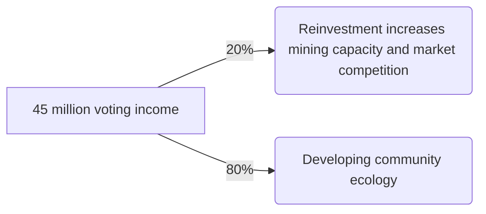
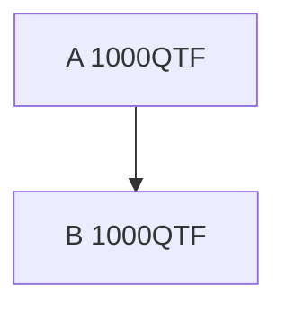
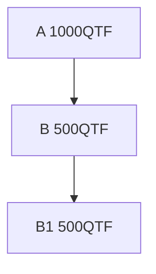

## Quantum Fund Project
- Quantum Fund Token (QFT)

#### Project Background
- In recent years, with the rapid development of the cryptocurrency market, global investors have paid more and more attention to this emerging asset class. However, at the same time, a large number of bad projects and Ponzi schemes have emerged in the market, causing many investors to suffer huge financial losses. These scams often use the banner of high returns, take advantage of information asymmetry and investors' greed, establish a capital-based operation model, and eventually collapse in market fluctuations, bringing huge risks to investors.

- In this context, the market's demand for safe and reliable investment methods has become particularly urgent. Traditional investment methods are difficult to adapt to the high volatility and complexity of the cryptocurrency market, and investment decisions made based on simple human judgment are easily affected by emotions and short-term market fluctuations.

- The launch of the Quantum Fund Project (QFT) was born in such a market environment. We are committed to providing professional investors with an efficient, safe and transparent investment platform by combining cutting-edge quantitative analysis technology and rigorous risk control measures. Our goal is to > abandon speculation and bad behavior in the market, focus on achieving stable investment returns through scientific investment methods and data-driven decision-making processes, and help investors achieve long-term wealth growth in a turbulent market environment.

- This project is not only a response to the current market chaos, but also our vision and commitment to the future of cryptocurrency investment. By introducing quantitative methods, we hope to bring more rational and transparent investment options to investors and promote the entire industry to a healthier and more sustainable direction.

#### Operation Mechanism
- In order to promote the Quantum Fund, we have introduced an innovative mining mechanism that draws on the concept of POS (Proof of Stake) mining. The more votes, the stronger the computing power. The design of this mechanism eliminates the risk of bubbles and will not cause the system to collapse.

- In order to attract more people to participate, we have designed a unique promotion mechanism. When the mining power of the promoted person increases, the promoter will also benefit, and vice versa, thus motivating everyone to actively vote and promote. This mechanism not only guarantees the motivation of participants, but also effectively prevents promotion cheating through non-linear algorithms. Cheating will lead to a loss of computing power, thereby reducing investors' returns. Through this design, we ensure the fairness and transparency of the entire system and promote the health and sustainable development of the ecosystem. [Computing power calculation rules] (#Computing power calculation rules)

- We have fully open-sourced the contract code and accepted strict review by peer experts to ensure the transparency and security of the system. Open source not only demonstrates our technical strength and confidence, but also injects the project with the genes to go global. We believe that through global cooperation and exchanges, Quantum Fund will be able to occupy a place on the international stage and bring reliable investment options to more investors. [Contract open source address](https://github.com/QuantumFunds/smart-contracts)

##### Issuance Mechanism
- The Quantum Fund plans to issue a total of 1 billion tokens, of which 50 million will be issued as the initial amount, and the remaining 950 million will be gradually released through mining. This design ensures that the distribution of tokens can effectively motivate participants and provide sufficient liquidity in the early stages of the project to support the steady development of the ecosystem.
- Initial allocation of 50 million

Project                 | Amount
:----------------------:|:-------------:
Decentralized Exchanges | 0.05 billion
Voting amount           | 0.45billion

- 1 QFT is produced per second, and 950 million can be mined in 10995.37 days (about 30.12 years)
- 80% of the mining output of 45 million votes will be used for community promotion and 20% will be used for reinvestment. The detailed flow chart is as follows:

- Community Ecosystem Rules
    - 10% of the investment amount goes into the fund for quantitative investment.
    - Formulate appropriate promotion rules based on market conditions.

##### Mining rules
- One QFT is mined per second.
- Mining is settled once a week. The system will record the maximum computing power submitted within a week as the effective computing power. The amount of mining this week is: (mining amount (7*24*3600) + fund income) * effective computing power of the address / total effective computing power.
- 13 weeks is a mining income cycle. In the current income cycle (13 weeks), the QFT purchased due to fund income is transferred to the mining contract and will become the fund income of the next income cycle for everyone to mine, thereby increasing the income of mining.
- After withdrawing your investment, you will need to wait for two settlement cycles (2 weeks).
- Mining should be done once a week to increase user stickiness. If you don’t do it, you will miss out on a profit.

##### Hash power rules
- Promote friends, improve computing power, and increase mining income
- Two cases of A promoting B
> Normal promotion

> Subordinate split

- Promotion is like a tree that keeps spreading downwards. If the simplest method is used for promotion, the promoter's profit cannot be guaranteed.
> - Example 1:
> 1. A promoted B, and B’s address has 1000 QFT.
> 2. The promotion value of A is 1000, and the promotion value of B is 0.
> 3. B creates a new account B1, establishes a promotion relationship between B and B1, and transfers the amount to B1.
> 4. The promotion value of A is 0, the promotion value of B is 1000, and the promotion value of B1 is 0. As a promoter, A does not receive any benefits.

- If the promotion relationship is adjusted to the minimum amount between the superior and the subordinate, and an address also has a relationship with the superior, it can prevent B from transferring all the amount.
> - Example 2:
> 1. Assume that A promotes B, and they both have 1,000 QTFs.
> 2. The promotion value added by A is 1000, and the promotion value added by B is also 1000.
> 3. B creates a new account B1 and transfers 1,000 QFT to B1. In this way, the income of both addresses is 0. Obviously, B will not do this. If 500 QFT is transferred to B1.
> 4. A's promotion value is increased by 500
    The promotion value of B is 500+500=1000
    The promotion value of B1 is 500
    The total promotion value of account B is 1000+500=1500. After account B1 is created, the promotion of the superior is reduced by 500, while the promotion of the account itself is increased by 500. Although this rule is much better than Example 1, it still causes loss of interest to the promoter.

- _In response to the above promotion problem, a nonlinear algorithm is proposed. The basic computing power of each account is equal to **1.125 power** of the voting amount. The weight of its own promotion computing power is **1** with that of its subordinates, **2** with that of its superiors, and its own weight is **4**._   
> - **Calculation method**  
> **Basic computing power:** $\Large pow(x) = x^{1.125} = x^{9/8} = x * \sqrt[8]{x}$      
> **Actual computing power:** $\Large f(x) = 6 * pow(x) + \min(pow(x),pow(x_{up})) + \sum(\min(pow(x),pow(x_{down})))$  
> - Example 3： 
> 1. A promoted B, and A and B each have 1,000 QFT in their addresses.
> 2. The increased computing power of A is: $1000^{1.125} \approx 2371.37$
> 3. The computing power of address B is:   $2371.37 + 2371.37 * 6 = 16599.59$
> 4. B creates a new account B1 and transfers 500 QFT to B1.
> 5. The computing power increased by address A is: $500^{1.125} \approx 1087.28$
> 6. The computing power of address B is:      $1087.28  + 1087.28 * 6 + 1087.28 = 8698.24$
> 7. The hashrate of B1 address is:     $1087.28 + 1087.28 * 6 = 7610.96$
> 8. The total computing power of account B is:   $8698.24 + 7610.96 = 16309.2$
> 9. B's computing power after the split is less than before the split, which constitutes a loss to promoter A and also to himself, so A has no motivation to do so.

##### Fund Returns
- 45% of the quarterly (13 weeks) profit can be used to purchase QFT on a decentralized exchange. The purchased QFT can be transferred to a mining contract to increase the mining yield in the next quarter.
- 45% of the quarterly profits will be used to snowball and expand the fund size.
- 10% of the profit each quarter is used to pay the team’s salaries.
